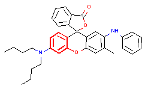

# BGCN-GCN
<p align="center">
    
</p>

"Bayesian Graph Convolutional Neural Network with Uncertainty Estimation to
Predict Mutagenicity of Chemicals"


To use it please download all the files, and place the dataset desired in the TOX folder under TEST.txt. Then simply run the desire train files. 

The Structural alerts image would be stored in IMG.

<a name="description"/>

## Description
Most models for toxicity lack uncertainty estimation but uncertainty estimation is
important for results interpretation since the prediction may be inaccurate if the
model does not have sufficient data. 

The deep learning models available use as
input either a human engineered set of chemical descriptors or the simplified
molecular-input line-entry system (SMILES) textual representation of molecules.

This work develops two families of new classification models for Ames
mutagenicity, both using deep learning and using directly the chemical graphs
<a name="Dataset"/>
## Dataset
Two data sets for the mutagenicity endpoint are used: a large data set collected from
different web sites (called Ames set), and the dataset from Japanese National Health
Institute and Science (NIHS set).
<a name="Architecture"/>

## Architecture
All the models use graph convolutional neural networks (GCN), a new architecture that
takes the chemical graph in input, thus avoiding the computation and selection of
chemical descriptors. Such models can provide uncertainty estimation

<a name="Results"/>

## Results
Below is the automatic extraction of the structural alert:
<p align="center">
  
</p>

## Requirements
The `requirements.txt` file lists most of the libraries that are necessary to run the scripts. **Install them** using:

```
pip install -r requirements.txt
```
Rdkit should be installed separately with the following command
```
conda create -c conda-forge -n my-rdkit-env rdkit
```
